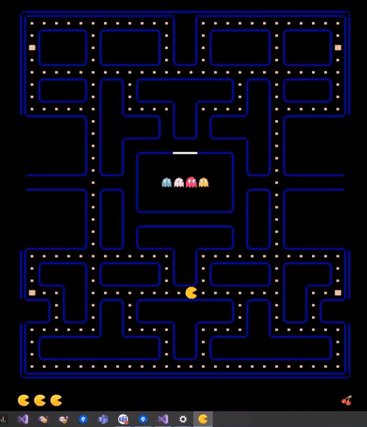

# PacMan
PacMan Game - WPF Application

Pac-Man[a] is a maze action game developed and released by Namco for arcades in 1980. The original Japanese title of Puck Man was changed to Pac-Man for international releases as a preventative measure against defacement of the arcade machines by changing the P to an F.[4] In North America, the game was released by Midway Manufacturing as part of its licensing agreement with Namco America. The player controls Pac-Man, who must eat all the dots inside an enclosed maze while avoiding four colored ghosts. Eating large flashing dots called "Power Pellets" causes the ghosts to turn blue, allowing Pac-Man to eat them for bonus points. [-Wikipedia](https://en.wikipedia.org/wiki/Pac-Man) 

